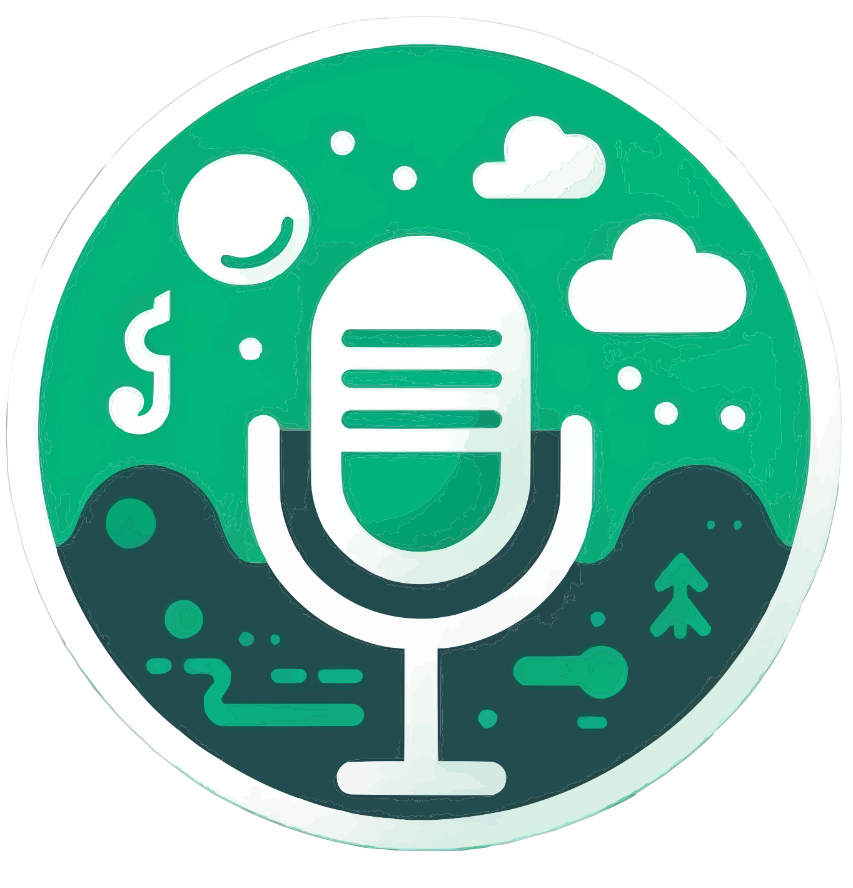

# **PodNiv: Transform Your Text Into Engaging Podcasts**

<div align="center">
    
</div>

### **Empower Your Content With Audio**
PodNiv is a SaaS platform that converts written text into high-quality, AI-driven podcasts. Whether you're a content creator, marketer, or business owner, PodNiv offers an effortless way to repurpose your written content into accessible, engaging audio experiences that your audience can enjoy on the go.

---

## **Live Website**
Check out the live version of PodNiv here: [PodNiv Live Website](https://pod-niv.vercel.app/)

---

## **Why PodNiv?**
In today’s fast-paced world, not everyone has time to sit down and read lengthy articles or blog posts. PodNiv bridges the gap between written and audio content, helping you meet your audience where they are—whether it’s during their commute, workout, or multitasking. By offering podcasts as an alternative, you not only increase accessibility but also deepen engagement with your audience.

### **Key Benefits**:
- **Accessibility**: Make your content available in a more flexible, easy-to-consume format.
- **Engagement**: Reach new audiences who prefer to listen rather than read.
- **Efficiency**: Convert text into podcasts in seconds, saving time for creators and businesses.

---

## ⚙️ **Tech Stack**
- **Next.js**
- **TypeScript**
- **Convex**
- **OpenAI**
- **Clerk**
- **ShadCN**
- **Tailwind CSS**

---

## 🔋 **Features**
* **Robust Authentication**: Secure and reliable user login and registration system.

* **Modern Home Page**: Showcases trending podcasts with a sticky podcast player for continuous listening.

* **Discover Podcasts Page**: Dedicated page for users to explore new and popular podcasts.

* **Fully Functional Search**: Allows users to find podcasts easily using various search criteria.

* **Create Podcast Page**: Enables podcast creation with text-to-audio conversion, AI image generation, and previews.

* **Multi Voice AI Functionality**: Supports multiple AI-generated voices for dynamic podcast creation.

* **Profile Page**: View all created podcasts with options to delete them.

* **Podcast Details Page**: Displays detailed information about each podcast, including creator details, number of listeners, and transcript.

* ***Podcast Player**: Features backward/forward controls, as well as mute/unmute functionality for a seamless listening experience.

* **Responsive Design**: Fully functional and visually appealing across all devices and screen sizes.

---

## **Project Structure**
```
- .env.copy
- .env.local
- .eslintrc.json
- .gitignore
- app/
  ├── (auth)/
  │   ├── layout.tsx
  │   └── sign-in/
  │       └── [[...sign-in]]/
  │           └── page.tsx
  │   └── sign-up/
  │       └── [[...sign-up]]/
  │           └── page.tsx
  ├── (root)/
  │   ├── create-podcast/
  │       └── page.tsx
  │   ├── discover/
  │       └── page.tsx
  │   ├── podcasts/
  │       └── [podcastId]/
  │           └── page.tsx
  │   ├── profile/
  │       └── [profileId]/
  │           └── page.tsx
  │   ├── globals.css
  │   └── layout.tsx
  └── favicon.ico
- components/
  ├── EmptyState.tsx
  ├── GeneratePodcast.tsx
  ├── GenerateThumbnail.tsx
  ├── Header.tsx
  ├── LeftSidebar.tsx
  ├── LoaderSpinner.tsx
  ├── MobileNav.tsx
  ├── PodcastCard.tsx
  ├── PodcastDetailPlayer.tsx
  ├── PodcastPlayer.tsx
  ├── ProfileCard.tsx
  ├── RightSidebar.tsx
  ├── Searchbar.tsx
  └── ui/
      ├── button.tsx
      ├── Carousel.tsx
      ├── EmblaCarouselDotButton.tsx
      ├── form.tsx
      ├── input.tsx
      ├── label.tsx
      ├── progress.tsx
      ├── select.tsx
      ├── sheet.tsx
      ├── textarea.tsx
      ├── toast.tsx
      ├── toaster.tsx
      └── use-toast.ts
- components.json
- constants/
  └── index.ts
- convex/
  ├── auth.config.ts
  ├── files.ts
  ├── http.ts
  ├── openai.ts
  ├── podcasts.ts
  ├── schema.ts
  └── users.ts
  └── _generated/
      ├── api.d.ts
      ├── api.js
      ├── dataModel.d.ts
      ├── server.d.ts
      └── server.js
- docs/
- lib/
  ├── formatTime.ts
  ├── useDebounce.ts
  └── utils.ts
- middleware.ts
- next-env.d.ts
- next.config.mjs
- package-lock.json
- package.json
- postcss.config.mjs
- providers/
  ├── AudioProvider.tsx
  └── ConvexClerkProvider.tsx
- public/
  ├── alloy.mp3
  ├── app.svg
  ├── appName.svg
  ├── arrow.svg
  ├── bg.png
  ├── confetti.gif
  ├── dockerName.svg
  ├── echo.mp3
  ├── icons/
  │   ├── auth-logo.svg
  │   ├── avatar.svg
  │   ├── delete.svg
  │   ├── play-gray.svg
  │   └── podniv-icon.svg
  ├── images/
  │   ├── bg-img.png
  │   └── player1.png
  └── nova.mp3
- README.md
- tailwind.config.ts
- tsconfig.json
- types/
  └── index.ts
```

---


## **Quick Start Guide**

### **Installation**
1. Clone the PodNiv repository:
   ```bash
   git clone https://github.com/Yanivv77/PodNiv.git
   cd PodNiv
   ```

2. Install dependencies:
   ```bash
   npm install
   ```

3. Set up environment variables:
   Rename the `.env.copy` file in the project root to `.env.local`, then add your keys:

4. Start the development server:
   ```bash
   npm run dev
   ```

### **Generate Your First Podcast**
Once the server is running, open your browser and navigate to `http://localhost:3000`. Simply input your text into the platform, customize the podcast settings, and click "Generate Podcast." In seconds, PodNiv will transform your text into a podcast thats ready-to-share.

---

## **How to Contribute**

We’re always open to contributions! Whether it’s new features, bug fixes, or enhancements, your ideas are welcome. Here’s how to get started:

1. Fork the repository.
2. Create a new branch:
   ```bash
   git checkout -b feature-branch
   ```
3. Make your changes and commit them:
   ```bash
   git commit -m 'Description of feature or fix'
   ```
4. Push your branch to GitHub:
   ```bash
   git push origin feature-branch
   ```
5. Open a pull request, and we’ll review your changes!

---

## **License**
PodNiv is licensed under the MIT License—feel free to use, modify, and distribute the project as needed.

---

## **Get in Touch**
Have questions or feedback? Feel free to reach out or open an issue on GitHub. We’d love to hear how PodNiv is helping you transform your content!
